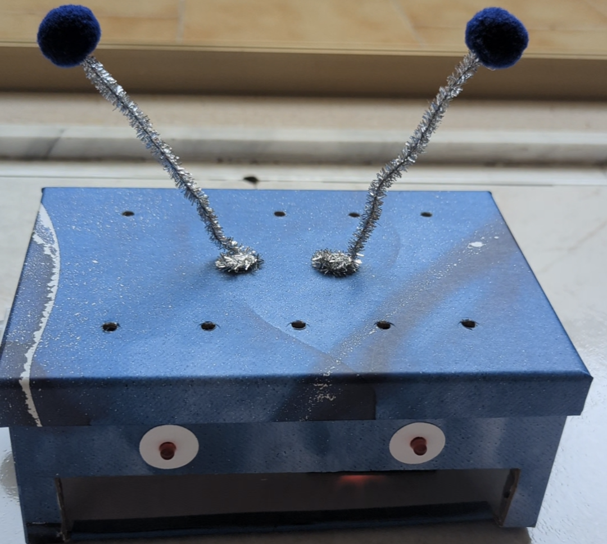

# ESP32-Motion-Sensor-with-Telegram-Notification

## Description

This project features an ESP32-based motion sensor system designed to notify users of any detected motion using the Telegram messaging platform.

